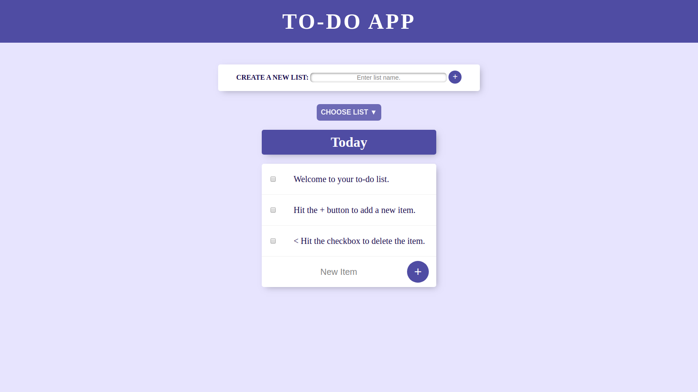
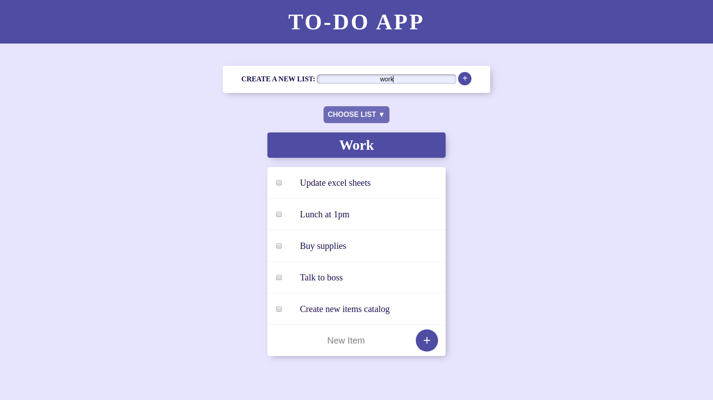
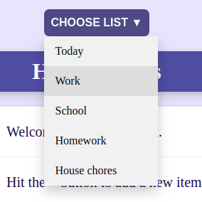
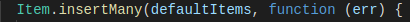
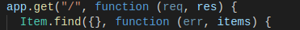
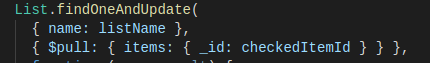
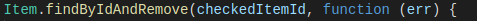

# To-Do-List-Node-EJS-

Custom To Do List wrote in node.js, using EJS has markup language, and mongoDB with mongoose has database. All of the CRUD operation are used in this project. Initalize it in the terminal with nodemon.

You can create your own list (the default is labeled Today):

And browse through the existing lists via dropdown button:

///////

The CRUD operations.

Create:

Read:

Update:

Delete:

